<div align="center">

# NEXUS BI

**AI-Powered Business Intelligence Platform**

An end-to-end analytics platform for a real Brazilian e-commerce marketplace: data pipeline, PostgreSQL model,
SQL analytics, machine learning, a REST API, a SaaS-style dashboard, and an analyst that answers questions in
plain language with SQL you can inspect.


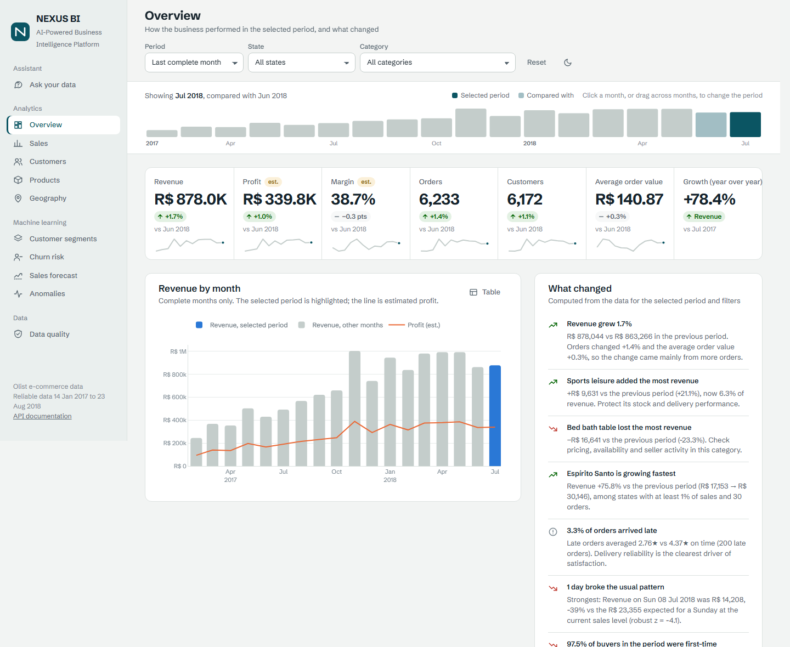

</div>

---

## Contents

1. [Description](#1-description) · 2. [Business problem](#2-business-problem) · 3. [Objectives](#3-objectives) ·
4. [Architecture](#4-architecture) · 5. [Technologies](#5-technologies) · 6. [Project structure](#6-project-structure) ·
7. [Data pipeline](#7-data-pipeline) · 8. [Database model](#8-database-model) · 9. [Machine learning](#9-machine-learning) ·
10. [AI Data Analyst](#10-ai-data-analyst) · 11. [Screenshots](#11-screenshots) · 12. [Installation](#12-installation) ·
13. [Configuration](#13-configuration) · 14. [How to run](#14-how-to-run) · 15. [Example queries](#15-example-queries) ·
16. [Results](#16-results) · 17. [Limitations](#17-limitations) · 18. [Future improvements](#18-future-improvements)

---

## 1. Description

NEXUS BI turns the public **Olist Brazilian E-Commerce dataset** (real, anonymised data: 99,441 orders,
96,096 customers, 32,951 products, 1M geolocation points, 2016–2018) into a working BI product:

- a **data pipeline** that validates, cleans and loads the raw files into a normalised PostgreSQL model and
  records every data-quality decision;
- an **analytics layer** in SQL (views, a materialized fact layer, window functions, CTEs, cohorts);
- **machine learning**: RFM segmentation, sales forecasting, churn prediction and anomaly detection, each
  compared against baselines and written back to the database;
- a **read-only FastAPI** backend and a **dashboard** with KPIs, filters, an interactive map and ML views;
- an **"Ask your data" analyst** that answers questions by running validated SQL, shows every query and its
  result, and checks every figure in the answer against the results.

Nothing is hard-coded: every chart, KPI, insight and answer is computed from the database at request time.

## 2. Business problem

A marketplace team needs to know how the business performs, **what changed and why**, where growth comes
from, which customers and products need attention, and what to expect next. The data exists, but it is
spread over nine files with duplicates, broken formats and impossible dates, and most people cannot write
SQL to explore it.

## 3. Objectives

- Build a trustworthy single source of truth from messy raw data, with an auditable data-quality report.
- Give business users KPIs, comparisons and data-backed findings for any period, state or category.
- Segment customers, estimate churn risk, forecast revenue and detect anomalies, with honest evaluation.
- Let people ask questions in plain language without letting a language model invent numbers.

## 4. Architecture

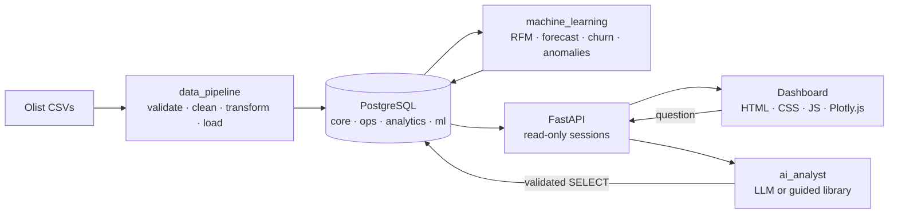

PostgreSQL is the only source of truth. The pipeline writes to it, the models read from it and write their
predictions back, and the API and the analyst only answer from what is stored there.

## 5. Technologies

| Area | Stack |
|---|---|
| Language | Python 3.12, SQL (PostgreSQL 18), JavaScript (ES modules) |
| Data | pandas, NumPy, SciPy, psycopg 3 (COPY bulk loads) |
| Database | PostgreSQL: normalised schema, constraints, indexes, views, materialized views, SQL functions |
| Machine learning | scikit-learn, XGBoost, statistical tests (Mann–Whitney, Poisson) |
| API | FastAPI, Pydantic v2, pydantic-settings, psycopg-pool |
| Frontend | HTML5, CSS3 (design tokens, light/dark), vanilla JavaScript, Plotly.js — no framework |
| AI | Anthropic Claude (optional), Ollama with an open local model (free), SQL AST validation with sqlglot |
| Quality | pytest (105 tests), Jupyter notebooks with executed outputs |
| Infrastructure | Docker, Docker Compose, `.env` configuration, Git |

## 6. Project structure

```
NEXUS-BI/
├── data_pipeline/        ingestion, validation, cleaning, transformation, load, setup_db (full build)
├── sql/                  schema.sql · views.sql · analytics.sql (16 analytical queries) · roles.sql
├── machine_learning/     segmentation/ · forecasting/ · churn/ · anomaly_detection/ · common.py
├── ai_analyst/           validation.py (SQL + figure guards) · sql_generator.py · analyst.py (Claude)
│                         local_llm.py (Ollama) · guided.py (no-AI library) · prompts/
├── backend/              main.py · config.py · api/ (routers) · services/ (SQL) · schemas/ · models/
├── frontend/             index.html · dashboard.html · css/ · js/ (app, state, charts, views/)
├── notebooks/            01 exploration · 02 EDA · 03 segmentation & churn · 04 forecasting · 05 anomalies
├── tests/                unit tests + integration tests (database and API)
├── docs/                 architecture.md · screenshots/
├── Dockerfile · docker-compose.yml · requirements.txt · requirements-dev.txt · .env.example
```

## 7. Data pipeline

```
RAW DATA → VALIDATION → CLEANING → TRANSFORMATION → POSTGRESQL → ANALYTICS
```

`python -m data_pipeline` downloads the data if needed, runs **105 checks**, loads everything in **one
transaction** (a single orphan row rolls back the whole load) and stores every issue in
`ops.data_quality_issues`. The report is produced by the pipeline, not written by hand:

```
Rows processed               1,550,922
Duplicates removed             261,831
Missing values handled             943
Invalid dates                    1,446
Outliers detected                5,835
Format errors corrected         88,544
Inconsistencies flagged          1,357
Final records                  563,733   (1M geolocation points collapse into 15,220 locations)
```

Real problems it found and handled:

- **Lost leading zeros** in 23,995 customer and 1,027 seller zip codes (`9790` instead of `09790`), which
  would have broken the join to coordinates.
- **Messy city names**: `sao paulo - sp`, `auriflama/sp`, a phone number and an e-mail typed as a city.
  They are normalised, and unusable values are imputed from the zip code.
- **Impossible dates**: 166 carrier pickups before the purchase are nulled; 1,193 plausible-but-odd sequences
  are flagged, not altered.
- **Truncated edges**: the extract fades out after 23 Aug 2018 (~200 orders/day falling to 0). The reliable
  window is derived from daily volume with a gaps-and-islands SQL query, so trends and KPIs never compare
  against half-captured months.

Every figure reconciles with the source: loaded revenue equals the raw CSV total (R$ 13,591,643.70) to the cent.

## 8. Database model

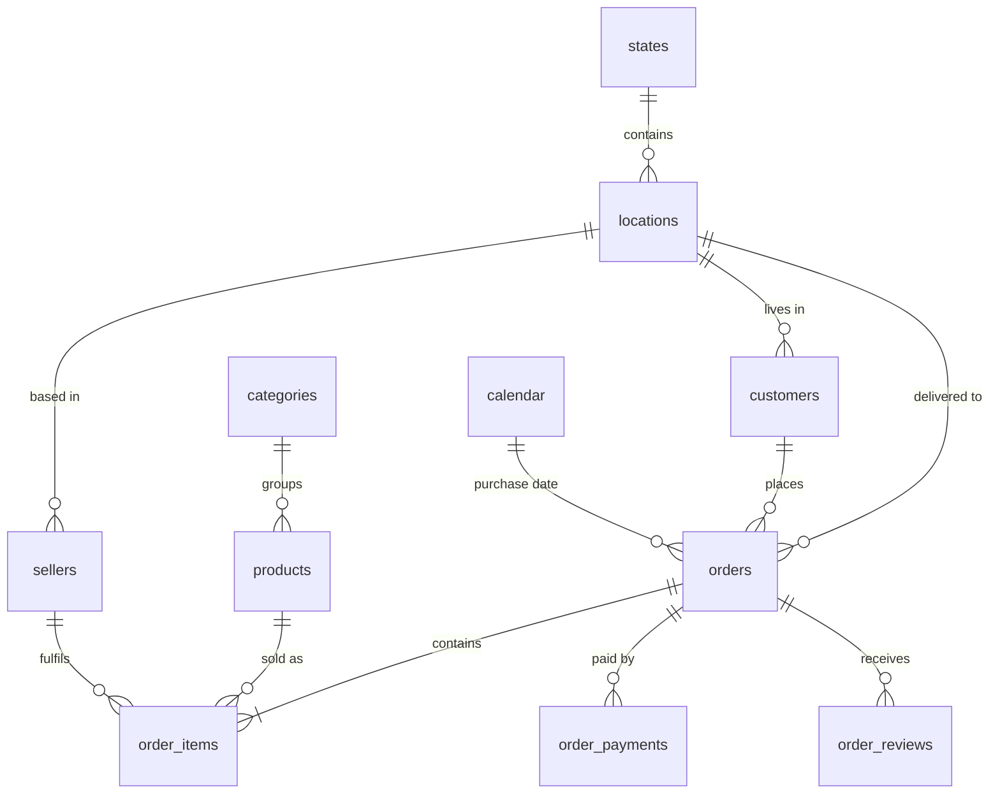

- **Schemas:** `core` (11 normalised tables), `ops` (pipeline runs, data-quality issues), `analytics`
  (views and materialized views), `ml` (model runs, evaluations and predictions).
- **Keys:** surrogate integer keys for joins, source hashes kept as unique `*_uid` columns.
- **The customer is `customer_unique_id`.** Olist issues a new `customer_id` per order; using it would make
  every buyer look new and invalidate retention, CLV, RFM and churn.
- **Constraints encode business rules:** chronology checks, value ranges, allowed statuses, coordinates
  inside Brazil, uid formats.
- **SQL showcase** (`sql/analytics.sql`): cohort retention, Pareto analysis, moving averages, YoY growth,
  NTILE deciles, percentiles, `width_bucket`, rolling z-scores. `analytics.kpi_summary()` compares any
  period with its previous one (calendar months against calendar months).

Full design notes: [docs/architecture.md](docs/architecture.md).

## 9. Machine learning

Every model is compared with simple baselines, evaluated on data it did not see, and written to the `ml`
schema with all candidate metrics.

| Module | Method | How it is validated | Result |
|---|---|---|---|
| **RFM segmentation** | Rules with thresholds taken from the real repurchase cycle: 75% of repeat purchases happen within **168 days**, 90% within **280** | Compared with K-Means (silhouette) in notebook 03 | VIP 0.7% · Loyal 0.6% · Potential 37.6% · At Risk 26.8% · Lost 34.4% of customers |
| **Sales forecast** (8 weeks, daily) | 2 baselines, Ridge, Random Forest, XGBoost; direct multi-horizon features | Rolling-origin backtest (7 origins × 56 unseen days); lowest MAE wins | Ridge: MAE R$ 6,153/day vs R$ 6,511 for the best baseline; 80% interval covers 74% of days out-of-fold |
| **Churn** (no purchase in 180 days) | Logistic regression, Random Forest, XGBoost; leak-free features at a cut-off date | 5-fold CV for selection + out-of-time test on a later period | ROC-AUC **0.606** (recency-only rule 0.567); top decile returns at 2.2× the average |
| **Anomalies** | Level-adjusted robust z-score, Isolation Forest, Poisson test per product | Statistical and practical significance (z ≥ 3.5 **and** ≥ 30% deviation) | 32 unusual days (Black Friday z = +37.5), 25 products, 95 customers — each with a plain-language explanation |

Honest findings, documented rather than hidden:

- **Simple beats complex in forecasting here.** Ridge wins on daily MAE, but the 4-week weekday average
  estimates the 8-week *total* better (8.7% vs 11.6% error), and the tree models finish last. A momentum
  feature was removed because the business moved from 2017 growth to a 2018 plateau and models trained on
  growth over-forecast by 15–18%.
- **Churn is weakly predictable from transactions alone.** Only ~1.2% of customers return within 180 days.
  "Everyone churns" is 98.8% accurate and useless, so the model is judged on ROC-AUC, PR-AUC and recall, and
  the dashboard presents it as a ranking tool, not a certainty.

Metric definitions (MAE, RMSE, MAPE, R², precision, recall, F1, ROC-AUC, confusion matrix) are explained in
the dashboard and in notebooks 03–05.

## 10. AI Data Analyst

```
USER QUESTION → LLM → SQL → VALIDATION → POSTGRESQL (read-only) → RESULT → ANSWER → FIGURE CHECK
```

Three modes, chosen automatically. All three share the same guards.

| Mode | Cost | What it answers |
|---|---|---|
| **Guided (no AI)** | Free, always available | A library of 8 business questions (and rephrasings) with prepared SQL. Recruiters can try it with no setup. |
| **Local AI (Ollama)** | Free, runs on your machine | Free-form questions; an open model (`qwen2.5-coder:7b`) writes the SQL in two constrained steps |
| **Claude** | Paid API, optional | Free-form questions; Claude iterates with a `run_sql` tool (up to 6 queries) |

**Guards against wrong or invented answers:**

1. **SQL validator** (`ai_analyst/validation.py`): parses the query's syntax tree with sqlglot and accepts
   only a single `SELECT` over an allow-list of analytics views. It rejects DML/DDL, `SELECT INTO`,
   `FOR UPDATE`, system catalogs, `pg_sleep`, `set_config`, `pg_read_file`, `dblink` and more (16 attack
   cases in the tests), then wraps the query in an outer `LIMIT`.
2. **Read-only execution**: a `READ ONLY` transaction with a 10 s timeout, optionally under a dedicated role
   with SELECT-only privileges (`sql/roles.sql`).
3. **Figure check**: every number in the final answer must match a value returned by the queries, within
   the rounding the text implies. Unmatched figures are shown to the user as a warning.
4. **Explainability**: the answer is always shown with each query's purpose, SQL and result table.
5. **Honesty**: questions the data cannot answer (marketing spend, product names, anything outside the
   database) get "the data cannot answer this" instead of a guess.

## 11. Screenshots

| | |
|---|---|
| 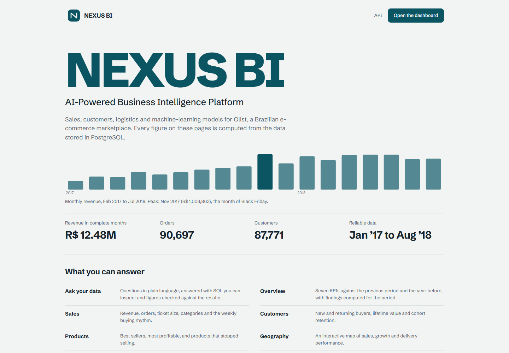 | 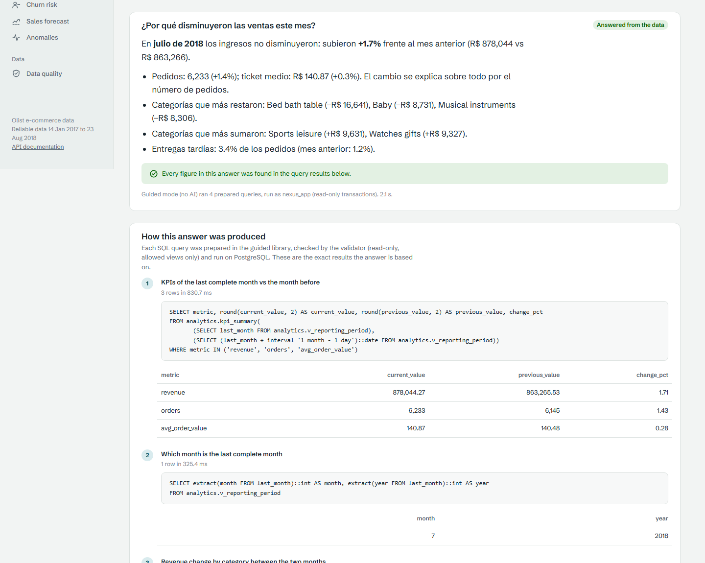 |
| **Entry page** with live facts from the API | **Ask your data**: answer, verification, SQL and results |
| 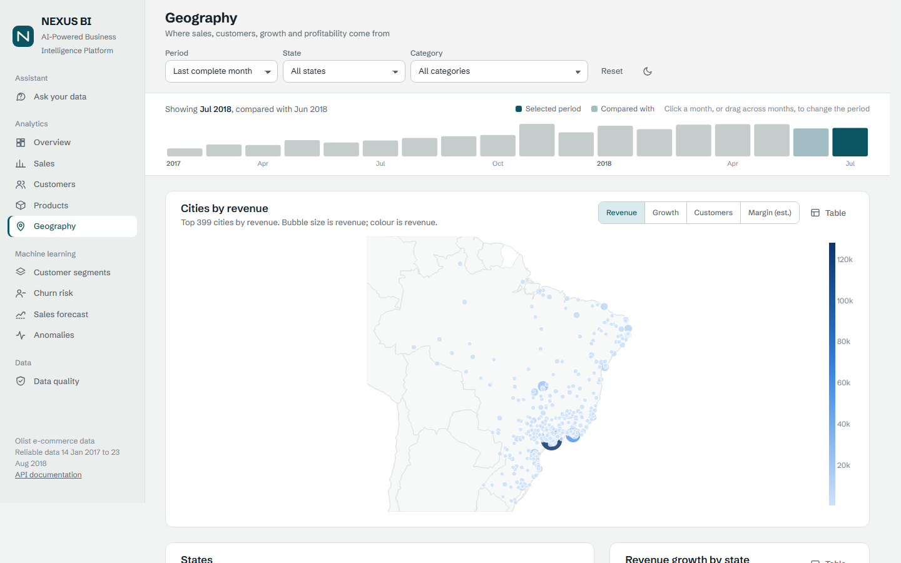 | 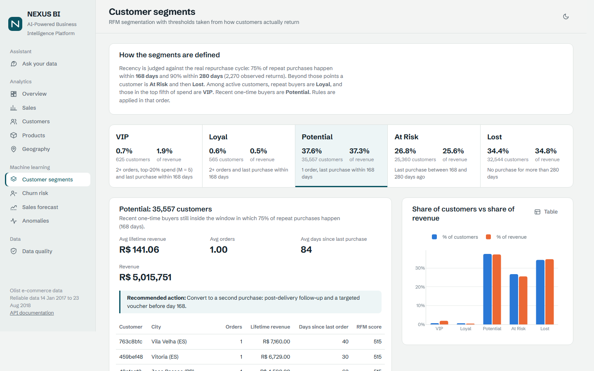 |
| **Geography**: city map and state growth | **RFM segments** with rules and recommended actions |
| 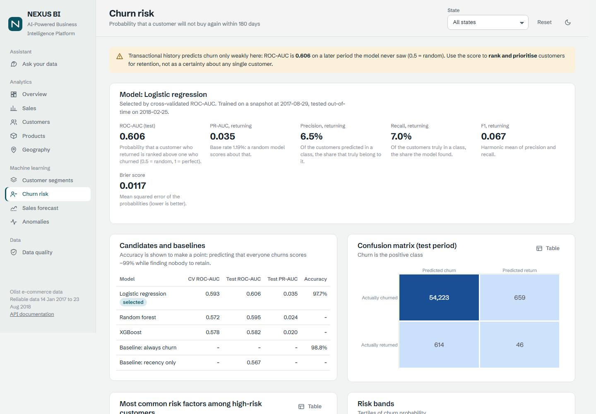 | 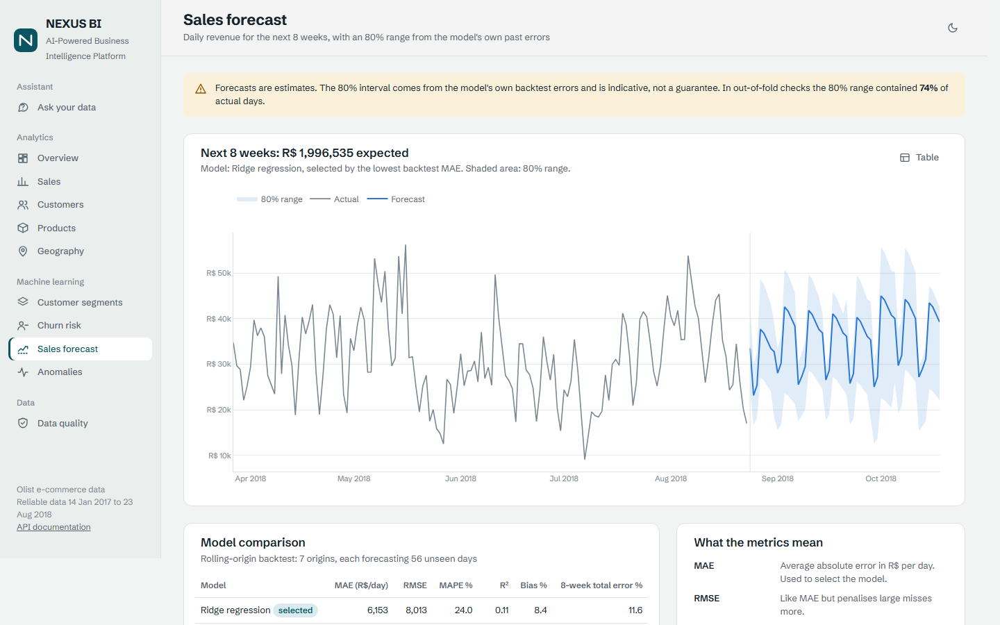 |
| **Churn risk**: honest metrics, baselines, risk factors | **Forecast** with an 80% range and model comparison |
| 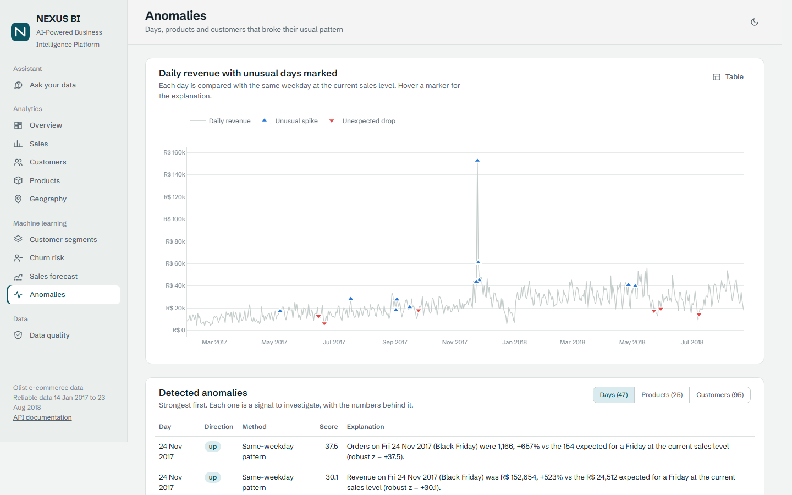 | 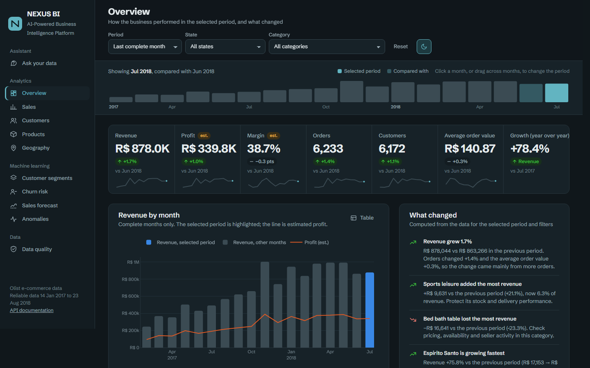 |
| **Anomalies** marked on daily revenue | **Dark mode** |

## 12. Installation

### Option A — Docker (one command)

Requires Docker Desktop.

```bash
git clone https://github.com/dsebas28/nexus-bi.git
cd nexus-bi
cp .env.example .env            # set POSTGRES_PASSWORD
docker compose up --build       # first run builds the database (~5 min), then serves the app
```

Open **http://localhost:8000**. The `init` service downloads the data, loads it, creates the views and
trains the models once; later starts skip it.

### Option B — Local (Python + PostgreSQL)

Requires Python 3.12 and PostgreSQL 16+.

```bash
python -m venv .venv
.venv\Scripts\activate                     # Windows  (Linux/macOS: source .venv/bin/activate)
pip install -r requirements-dev.txt

# Create the database and its owner (as the postgres superuser)
psql -U postgres -c "CREATE ROLE nexus_app LOGIN PASSWORD 'change_me';" -c "CREATE DATABASE nexus_bi OWNER nexus_app;"

cp .env.example .env                       # set POSTGRES_PASSWORD
python -m data_pipeline.setup_db           # schema → pipeline → views → models (~3–5 min)
```

## 13. Configuration

All settings come from environment variables or `.env` (never committed; see `.env.example`).

| Variable | Purpose | Default |
|---|---|---|
| `POSTGRES_HOST / PORT / DB / USER / PASSWORD` | Database connection | `localhost:5432/nexus_bi` |
| `API_CORS_ORIGINS` | Browser origins allowed to call the API | `http://localhost:8000` |
| `API_CACHE_TTL_SECONDS` | In-process cache for read queries | `300` |
| `AI_PROVIDER` | `auto`, `anthropic`, `ollama` or `guided` | `auto` |
| `OLLAMA_URL`, `OLLAMA_MODEL`, `OLLAMA_NUM_GPU` | Free local AI (`OLLAMA_NUM_GPU=0` forces CPU) | `qwen2.5-coder:7b` |
| `ANTHROPIC_API_KEY`, `AI_MODEL` | Optional Claude mode | empty, `claude-opus-5` |
| `AI_RATE_LIMIT_PER_MINUTE`, `AI_ACCESS_TOKEN` | Protect the analyst endpoint when deployed | `6`, empty |
| `AI_DB_USER`, `AI_DB_PASSWORD` | Dedicated read-only role for generated SQL | empty |

## 14. How to run

```bash
python -m uvicorn backend.main:app --reload     # app on http://localhost:8000, API docs on /docs
python -m data_pipeline                          # reload the data (then re-run the models)
python -m machine_learning                       # train all models (or: segmentation | forecast | churn | anomalies)
python -m pytest                                 # 105 tests (integration tests skip if the DB is not loaded)
jupyter lab notebooks                            # notebooks, kernel "Python (NEXUS BI)"
```

Optional free AI: install [Ollama](https://ollama.com), run `ollama pull qwen2.5-coder:7b`, and reload the page.

## 15. Example queries

**Plain language** (Ask your data):

- *¿Por qué disminuyeron las ventas este mes?* → July 2018 revenue did **not** fall: +1.7% vs June
  (R$ 878,044 vs R$ 863,266), driven by more orders. Bed bath table lost the most (−R$ 16,641), sports leisure
  gained the most (+R$ 9,631), and late deliveries rose from 1.2% to 3.4%.
- *¿Cómo afectan los retrasos en la entrega a las reseñas?* → Late orders average **2.27★** vs **4.29★**
  on time, and 53.7% of them get 1★ (vs 6.6%).

**SQL** (`sql/analytics.sql`, run with `psql -f`):

```sql
-- KPI cards for any period vs its previous period, with optional state/category filters
SELECT * FROM analytics.kpi_summary('2018-04-01', '2018-06-30', 'SP');

-- Pareto: share of the catalogue that generates 80% of revenue
WITH ranked AS (
    SELECT revenue,
           sum(revenue) OVER (ORDER BY revenue DESC, product_key) / sum(revenue) OVER () AS cumulative_share,
           row_number() OVER (ORDER BY revenue DESC, product_key) AS product_rank,
           count(*) OVER () AS total_products
    FROM analytics.v_product_performance)
SELECT min(product_rank)::numeric / max(total_products) AS share_of_catalogue
FROM ranked WHERE cumulative_share >= 0.80;
```

**REST API** (interactive docs at `/docs`): `GET /api/v1/kpis?start=2018-04-01&end=2018-06-30&state=SP`,
`GET /api/v1/insights`, `GET /api/v1/churn/customers?risk_band=High&segment=VIP`,
`POST /api/v1/ai/ask {"question": "..."}`.

## 16. Results

What the data says (all figures are computed by the platform; see notebooks 02–05):

- **Growth, then a plateau.** Monthly revenue grew from R$ 244,959 (Feb 2017) to a peak of R$ 1,003,862 in
  November 2017 (Black Friday), and levelled off in 2018.
- **Retention is the biggest gap.** Only 3.04% of customers ever bought twice; month-1 retention stays below
  1% for every cohort. Converting recent one-time buyers (the Potential segment, 37.6% of customers) is the
  largest lever.
- **Delivery drives satisfaction.** Late orders are rated 2.27★ vs 4.29★ (Mann–Whitney p < 1e-300, large
  effect), which makes delivery reliability a priority in the states with the highest late rates.
- **Revenue is concentrated.** São Paulo generates 38.3% of revenue; 25.9% of products generate 80% of it.
- **Engineering:** 105 automated tests; a fresh install (empty PostgreSQL → full platform) builds in about
  3 minutes and is reproducible — models use fixed seeds and produce identical metrics on every run.

## 17. Limitations

- **Profit and margin are estimates.** Olist does not publish product costs, so a synthetic, documented cost
  model is used (category baselines plus a deterministic per-product variation). Every profit or margin is
  labelled "estimated"; all other metrics are real.
- **Anonymised products and customers.** Products appear as short ids with their category.
- **Historical window.** Reliable data covers Jan 2017 – Aug 2018; "today" is 24 Aug 2018.
- **Churn signal is weak** (ROC-AUC 0.61) because the data has no browsing, marketing or support history.
- **The local AI model is slow on a CPU** (about 1–3 minutes per question on a laptop CPU) and makes more mistakes than Claude,
  for example misreading a ratio as a percentage. That is why every answer shows its SQL and results.
- **Guided mode** only answers the questions in its library (it says so for any other question).

## 18. Future improvements

- Incremental loads (CDC) instead of full refreshes, orchestrated with Airflow or Dagster.
- dbt for the analytics layer, with tests and documentation generated from the models.
- Model monitoring: drift detection and scheduled retraining with tracked experiments (MLflow).
- Richer churn features (browsing, marketing contacts) and uplift modelling for retention campaigns.
- Authentication and per-user rate limits for a public deployment; CI (GitHub Actions) running the test suite.
- An evaluation set for the AI analyst to measure SQL accuracy across models.

---

**Data:** [Olist Brazilian E-Commerce Public Dataset](https://github.com/olist/work-at-olist-data) (CC BY-NC-SA 4.0).
