# Base de datos (PostgreSQL 18)

NEXUS BI usa **PostgreSQL como única fuente de verdad**. El pipeline escribe en ella, los modelos de machine learning leen de ella y guardan sus predicciones en ella, y la API, el dashboard y el analista de IA solo responden con lo que está guardado allí.

Todas las imágenes de este documento se generaron ejecutando las consultas **sobre la base real** (99.441 pedidos del dataset público de Olist): los resultados no están escritos a mano. Los diagramas se construyeron leyendo las claves foráneas del esquema, así que siempre reflejan `sql/schema.sql`.

## Contenido

- [Esquemas](#esquemas)
- [Diagramas entidad-relación](#diagramas-entidad-relación)
- [Decisiones de diseño](#decisiones-de-diseño)
- [Consultas de ejemplo](#consultas-de-ejemplo)
- [Cómo reproducir las consultas](#cómo-reproducir-las-consultas)

## Esquemas

| Esquema | Qué guarda | Archivo |
|---|---|---|
| `core` | El modelo normalizado: 11 tablas (pedidos, líneas, pagos, reseñas, clientes, vendedores, productos, categorías, ubicaciones, estados y calendario) | [`sql/schema.sql`](../sql/schema.sql) |
| `ops` | Auditoría del pipeline: cada ejecución y cada problema de calidad de datos detectado | [`sql/schema.sql`](../sql/schema.sql) |
| `analytics` | La capa de análisis: vistas, 2 vistas materializadas y funciones SQL (`kpi_summary`, `previous_period`) | [`sql/views.sql`](../sql/views.sql) |
| `ml` | Resultados de los modelos: ejecuciones, métricas, segmentos, riesgo de abandono, pronóstico y anomalías | [`sql/schema.sql`](../sql/schema.sql) |

Además, [`sql/analytics.sql`](../sql/analytics.sql) contiene 16 consultas analíticas comentadas y [`sql/roles.sql`](../sql/roles.sql) crea un rol de solo lectura para el SQL que genera la IA.

## Diagramas entidad-relación

Cada diagrama muestra las claves primarias (PK), las foráneas (FK) y las columnas más relevantes. El código Mermaid de cada uno está en [`docs/database/`](database/) (archivos `.mmd`).

### Ventas: pedidos, líneas, pagos y reseñas
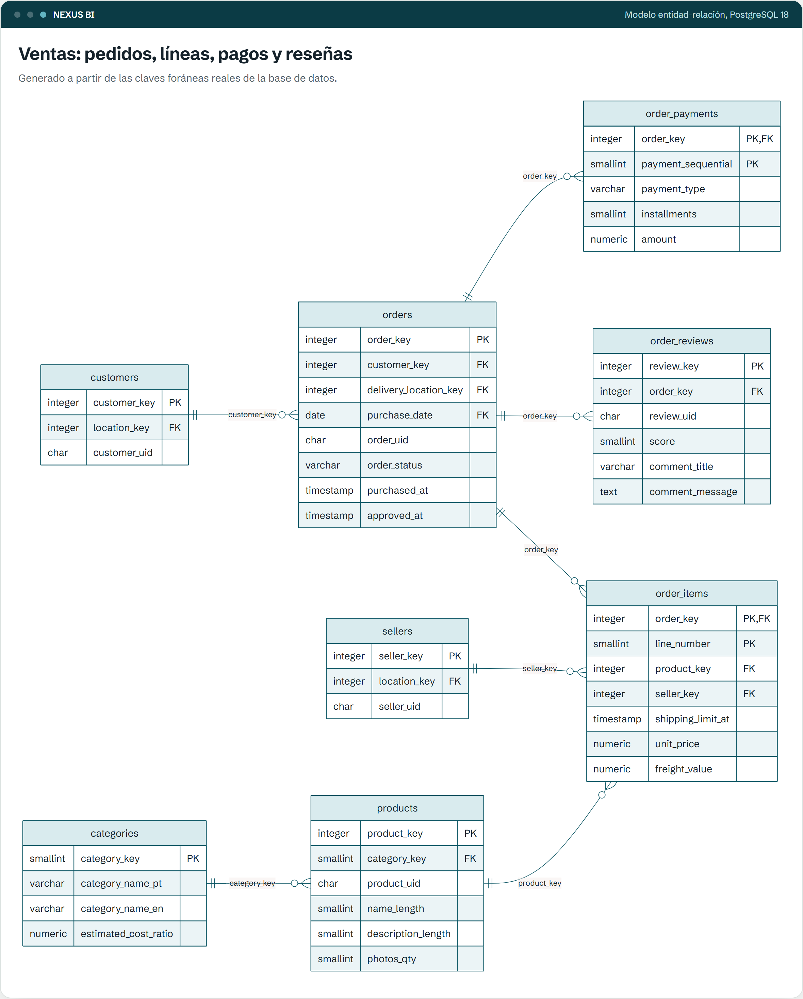

### Geografía y calendario
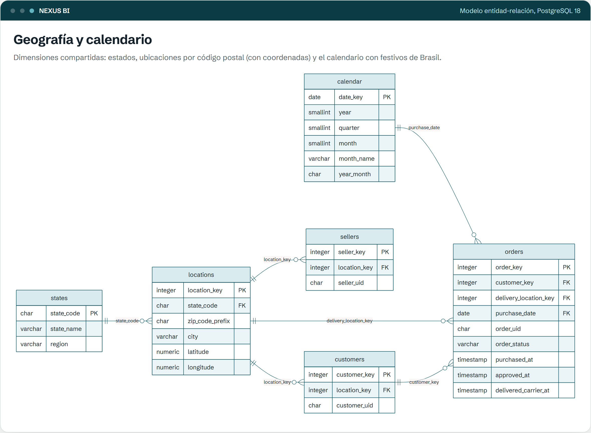

### Machine learning
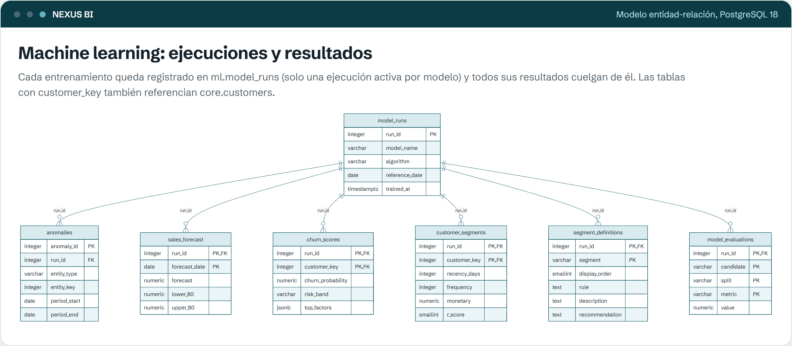

### Operaciones: pipeline y calidad de datos
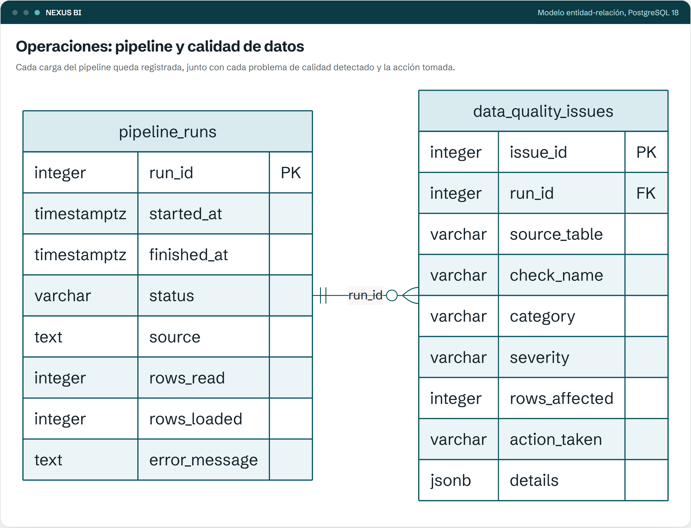

## Decisiones de diseño

| Decisión | Por qué |
|---|---|
| **Claves sustitutas enteras** (`GENERATED ALWAYS AS IDENTITY`) y los hashes de Olist como columnas únicas `*_uid` | Los joins sobre enteros son más rápidos y pequeños que sobre textos de 32 caracteres; el identificador original se conserva para trazabilidad. |
| **El cliente es `customer_unique_id`** | Olist crea un `customer_id` nuevo en cada pedido. Usarlo haría que todos los compradores parecieran nuevos e invalidaría retención, RFM y churn. |
| **Restricciones `CHECK` con las reglas de negocio** | Fechas en orden (la aprobación no puede ser anterior a la compra), notas de 1 a 5, estados permitidos, coordenadas dentro de Brasil, formato de los uid. Un dato imposible no entra aunque el código falle. |
| **Columna generada** `purchase_date` | Se calcula sola a partir de `purchased_at` (`GENERATED ALWAYS AS ... STORED`) y es clave foránea al calendario. |
| **Dimensión calendario** con festivos de Brasil | Permite analizar fines de semana, festivos y semanas ISO sin cálculos repetidos en cada consulta. |
| **Vistas materializadas** (`v_orders`, `v_customer_summary`) | Precalculan lo que casi todas las consultas necesitan (ingresos por pedido, retrasos, historial del cliente); se refrescan al final de cada carga. |
| **Índice compuesto** `(customer_key, purchased_at)` | Recencia, churn y CLV leen el historial de cada cliente en orden de fecha: el índice lo resuelve sin tocar la tabla. |
| **Una sola ejecución activa por modelo** | Índice único parcial `UNIQUE (model_name) WHERE is_active`: la API siempre lee una única versión de cada modelo. |
| **Carga todo o nada** | El pipeline carga todo en una transacción; si una sola fila queda huérfana, se revierte la carga entera. |
| **Costos sintéticos documentados** | Olist no publica costos. El ratio de costo estimado está marcado como `SYNTHETIC` con un `COMMENT` en la propia base de datos. |

## Consultas de ejemplo

Los archivos SQL están en [`docs/database/queries/`](database/queries/) y se pueden ejecutar tal cual.

### 1. Ingresos mensuales con media móvil
[`01-ingresos-mensuales.sql`](database/queries/01-ingresos-mensuales.sql): funciones de ventana con marco `ROWS BETWEEN 2 PRECEDING AND CURRENT ROW`.

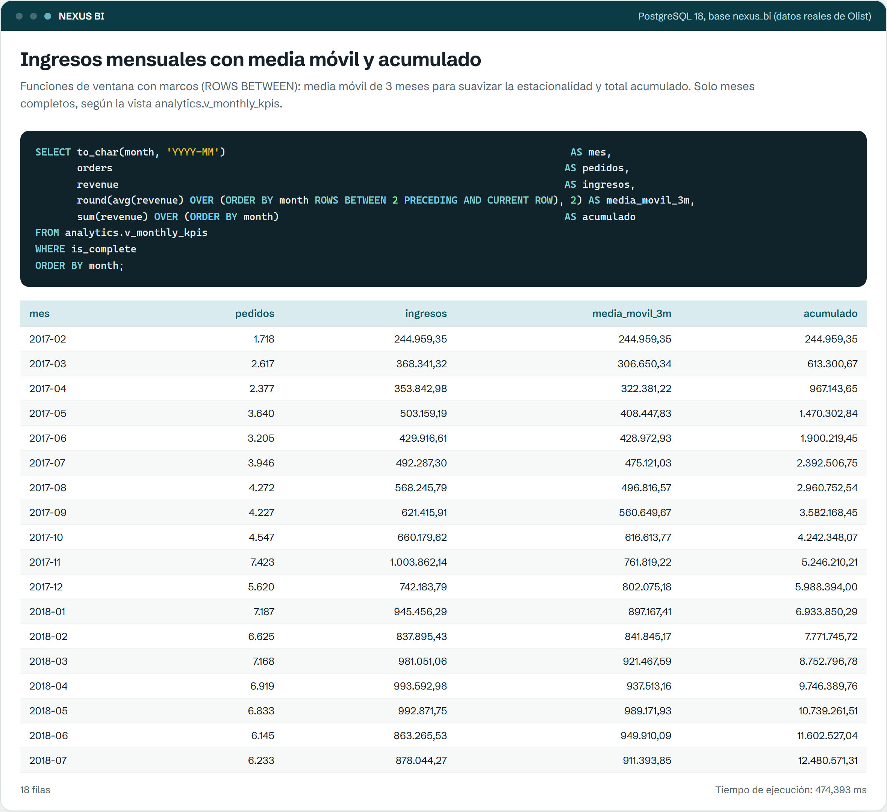

### 2. Categorías líderes por trimestre
[`02-top-categorias-por-trimestre.sql`](database/queries/02-top-categorias-por-trimestre.sql): CTE encadenadas y `DENSE_RANK()` por partición.

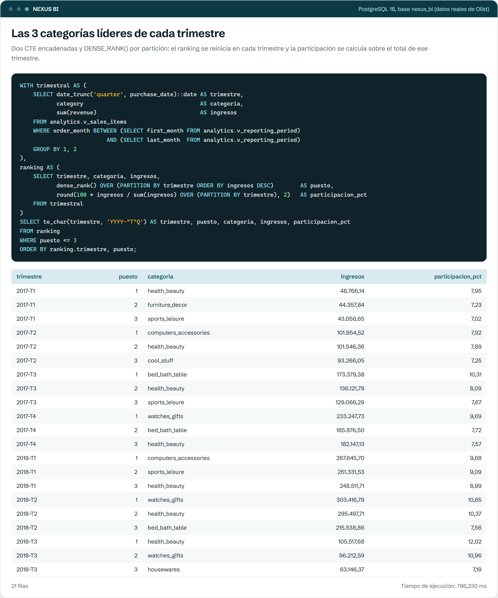

### 3. Pareto 80/20
[`03-pareto.sql`](database/queries/03-pareto.sql): participación acumulada con `SUM() OVER`.

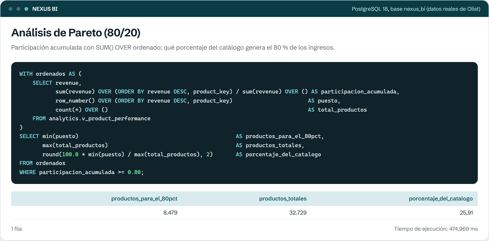

### 4. Retención por cohortes
[`04-cohortes-de-retencion.sql`](database/queries/04-cohortes-de-retencion.sql): `age()` y `FILTER` para pivotar meses en columnas. Muestra el hallazgo principal del proyecto: menos del 1 % de cada cohorte vuelve a comprar al mes siguiente.

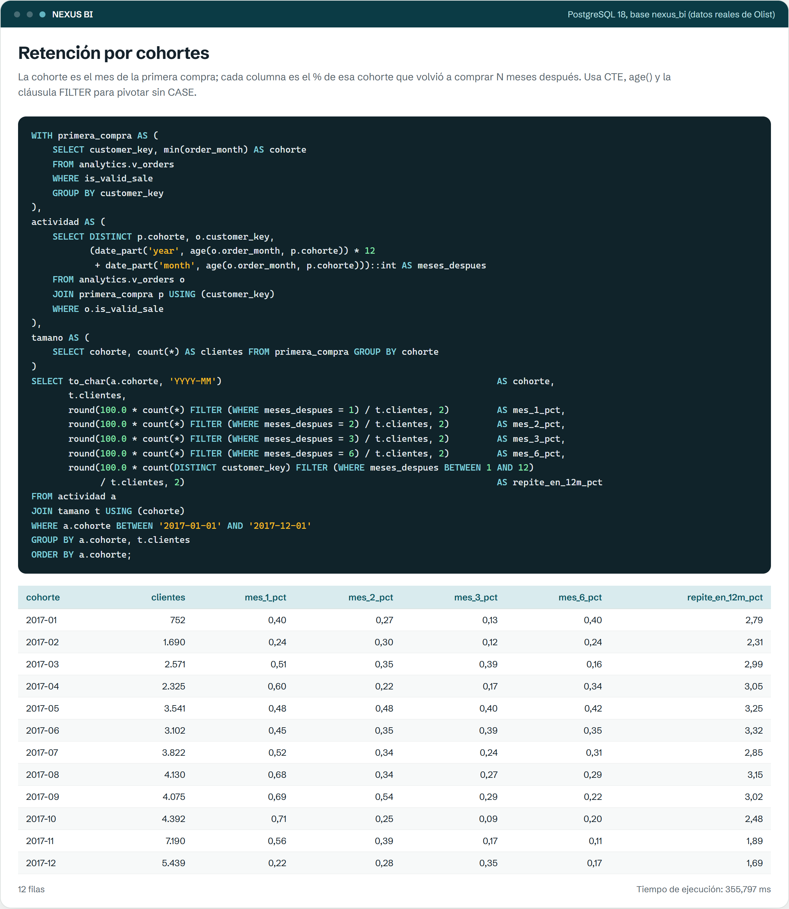

### 5. Retrasos y reseñas
[`05-retrasos-y-resenas.sql`](database/queries/05-retrasos-y-resenas.sql): los pedidos tardíos tienen una nota media mucho más baja.

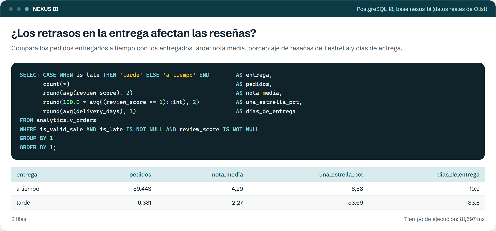

### 6. Logística por estado
[`06-logistica-por-estado.sql`](database/queries/06-logistica-por-estado.sql): ranking con `RANK()`.

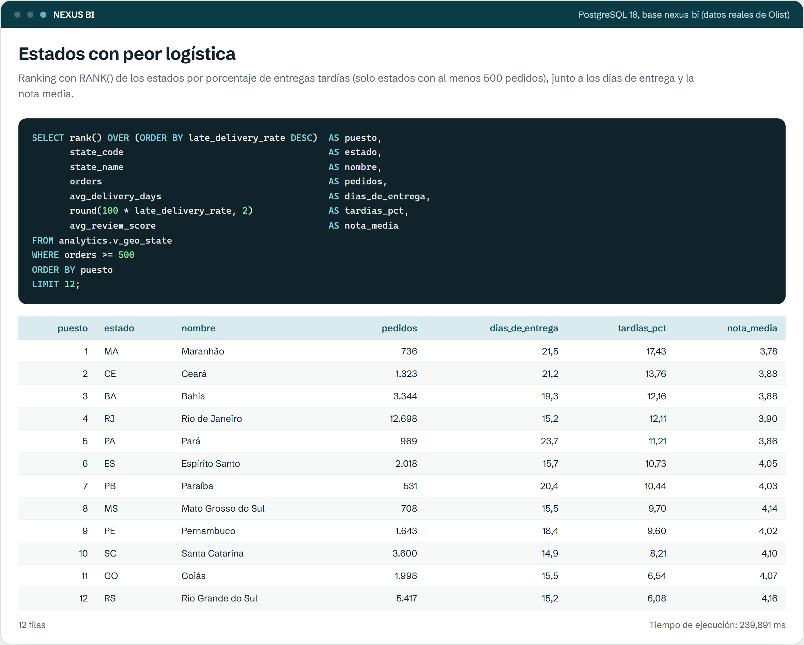

### 7. Dependencia de los mejores vendedores
[`07-deciles-de-vendedores.sql`](database/queries/07-deciles-de-vendedores.sql): `NTILE(10)` y una ventana sobre un agregado.

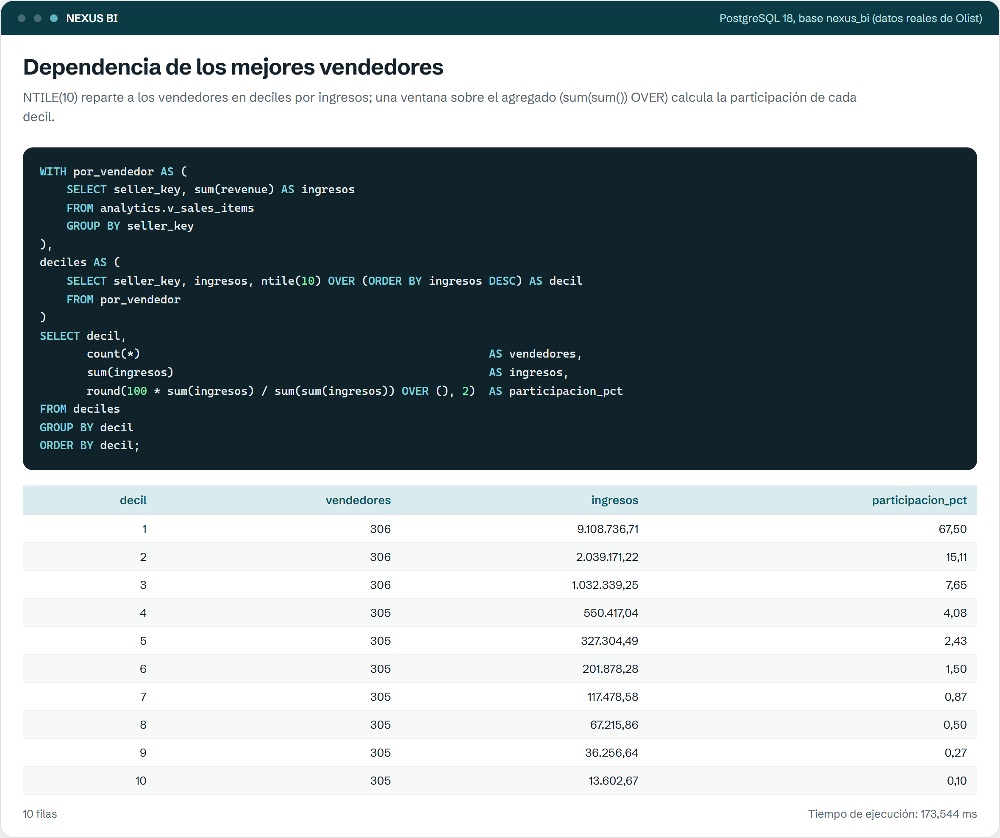

### 8. Función SQL de KPIs
[`08-funcion-kpi-summary.sql`](database/queries/08-funcion-kpi-summary.sql): la misma función que usan las tarjetas del dashboard.

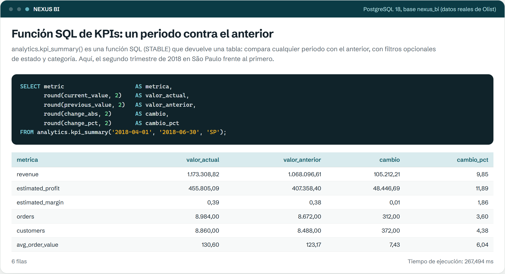

### 9. Segmentos de clientes
[`09-segmentos-rfm.sql`](database/queries/09-segmentos-rfm.sql): resultados del modelo RFM leídos desde el esquema `ml`.

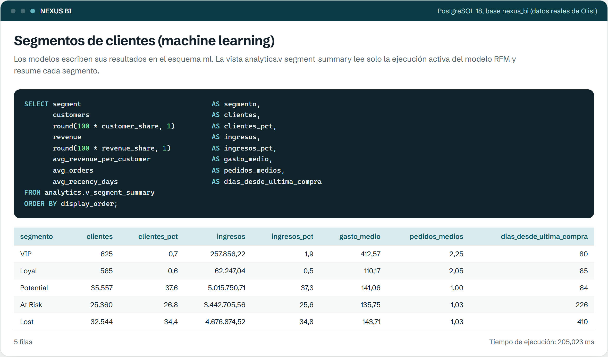

### 10. Calidad de datos
[`10-calidad-de-datos.sql`](database/queries/10-calidad-de-datos.sql): el informe de calidad es una consulta sobre lo que registró el pipeline.

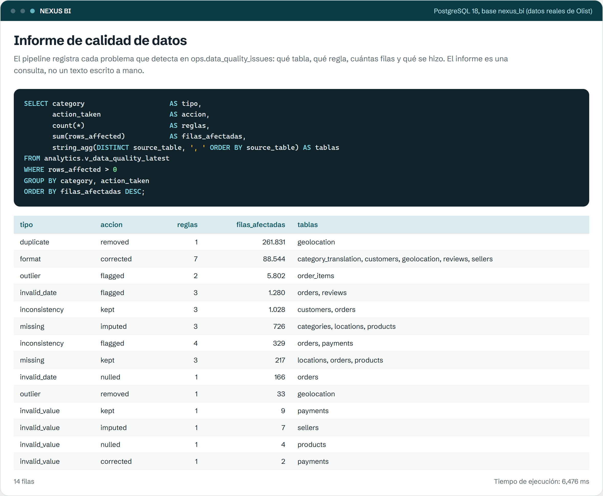

### 11. Las restricciones protegen los datos
[`11-restricciones-check.sql`](database/queries/11-restricciones-check.sql): PostgreSQL rechaza una reseña de 6 estrellas.

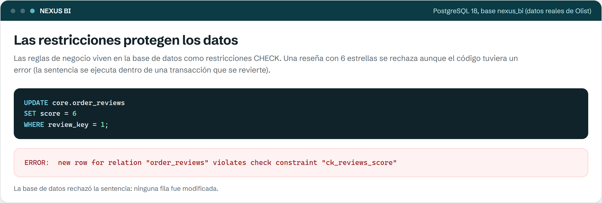

### 12. Plan de ejecución
[`12-plan-de-ejecucion.sql`](database/queries/12-plan-de-ejecucion.sql): `EXPLAIN ANALYZE` muestra un *Index Only Scan* sobre el índice compuesto.

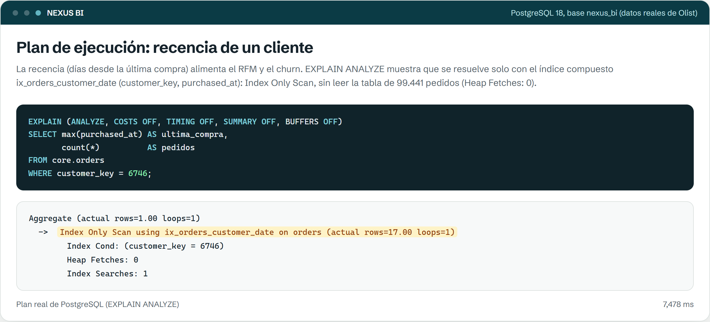

### 13. Tablas por tamaño
[`13-tablas.sql`](database/queries/13-tablas.sql): estadísticas del catálogo de PostgreSQL.

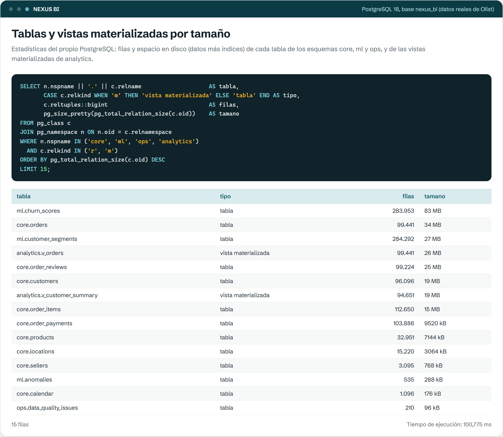

## Cómo reproducir las consultas

Con Docker (`docker compose up --build`), la base se construye sola y queda publicada en el puerto **5433** del equipo:

```bash
docker compose exec db psql -U nexus_app -d nexus_bi
docker compose exec -T db psql -U nexus_app -d nexus_bi < docs/database/queries/04-cohortes-de-retencion.sql
```

Con un PostgreSQL local (instalación de la opción B del README):

```bash
psql -U nexus_app -d nexus_bi -f docs/database/queries/04-cohortes-de-retencion.sql
psql -U nexus_app -d nexus_bi -f sql/analytics.sql      # las 16 consultas analíticas
```

También se puede abrir con DBeaver, pgAdmin o TablePlus: host `localhost`, base `nexus_bi`, usuario `nexus_app` y la contraseña de `POSTGRES_PASSWORD` en `.env`.
