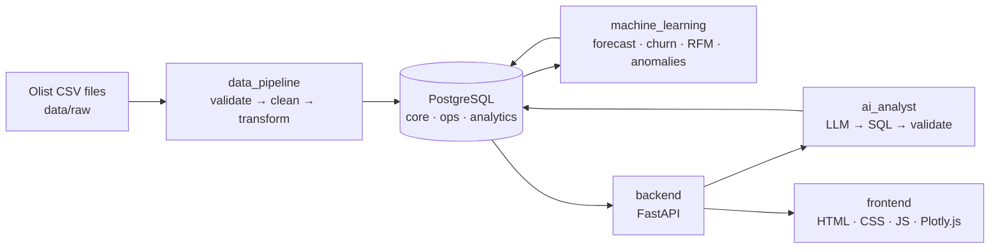
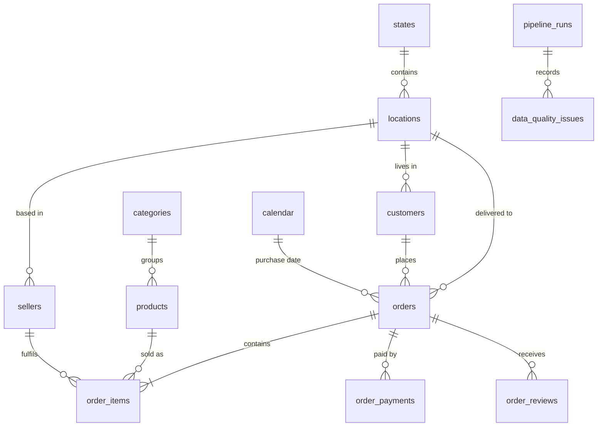

# NEXUS BI — Architecture, Dataset and Data Model

## 1. System overview

PostgreSQL is the single source of truth. The pipeline writes to it, ML models read
from it and write their predictions back to it, and both the API and the AI analyst
only answer from what is stored there.

| Folder | Responsibility |
|---|---|
| `data_pipeline/` | Reads raw CSVs, validates them, cleans and transforms them, loads PostgreSQL and records every data-quality issue in `ops.data_quality_issues`. |
| `sql/` | `schema.sql` (tables, constraints, indexes), `views.sql` (reusable analytics views), `analytics.sql` (CTEs, window functions, advanced queries). |
| `machine_learning/` | One sub-package per model: training, evaluation and writing predictions back to the database. |
| `backend/` | FastAPI app: `api/` routers, `services/` business logic and queries, `schemas/` Pydantic request/response models, `models/` DB access helpers. |
| `ai_analyst/` | Question → SQL generation → SQL validation (read-only, allow-listed) → execution → grounded answer. |
| `frontend/` | Static SaaS-style dashboard consuming the API. |
| `notebooks/` | Exploratory work and model experiments that justify the production code. |
| `tests/` | Automated tests for the pipeline, calculations, API and models. |
| `docs/` | Design documentation (this file). |

## 2. Dataset

**Olist Brazilian E-Commerce Public Dataset** — real, anonymised orders from Olist, a
Brazilian marketplace, published by the company under CC BY-NC-SA 4.0.
Source: <https://github.com/olist/work-at-olist-data>.

| File | Rows |
|---|---:|
| orders | 99,441 |
| order_items | 112,650 |
| order_payments | 103,886 |
| order_reviews | 99,224 |
| customers | 99,441 (96,096 unique people) |
| products | 32,951 |
| sellers | 3,095 |
| geolocation | 1,000,163 |
| category translation | 71 |

Period: 2016-09-04 to 2018-10-17, but the extract has incomplete edges: sparse test
orders in late 2016, a gap around the 2017 new year, and a fade-out from 2018-08-23
(from ~200 orders/day to ~0). The reliable window is derived from daily order volume in
`analytics.v_reporting_period`. In the current data it runs from **2017-01-14 to
2018-08-23**, with complete months **Feb 2017 – Jul 2018** and reference date
("today") **2018-08-24**. Nothing outside that window is used for trends, KPIs
comparisons or model training.

### Why this dataset

- It is real company data with a genuine relational structure (orders, items,
  payments, reviews, customers, sellers, products, locations).
- It is large enough to be non-trivial (~1.4M raw rows in total) and small enough to
  run on a laptop.
- It has latitude and longitude, which a geographic analysis needs, and delivery and
  review data, which give useful churn features.
- It contains real data-quality problems for the pipeline to handle (see below).

### Known limitations (stated openly)

1. **No product cost.** Olist does not publish costs, so profit and margin cannot be
   observed. NEXUS BI uses a **synthetic, clearly labelled** cost model: each category
   has a baseline cost-to-price ratio, and each product gets a deterministic variation
   seeded by its id (rules in `COST_RATIO_RULES`, `data_pipeline/transformation.py`).
   Every profit or margin figure in the platform is marked as *estimated*. Revenue,
   orders, customers and every other metric are real.
2. **No product names.** Products are anonymised hashes. They are shown by category
   and a short id.
3. **Few repeat customers.** Only 2,997 of 96,096 customers (about 3%) bought more
   than once. This is a real property of the business, not a data error. As a result:
   - churn is modelled as *"will the customer buy again within N days"*, a heavily
     imbalanced problem, which is evaluated with precision, recall and ROC-AUC rather
     than accuracy;
   - RFM frequency is almost always 1, so segments rely on recency and monetary value,
     and on frequency only where it discriminates.

### Data-quality problems found while profiling the raw files

| Problem | Rows |
|---|---:|
| Duplicate geolocation rows | 261,831 |
| Geolocation points outside Brazil | 42 |
| Customer zip prefixes with no coordinates | 279 |
| Products without category | 610 |
| Categories missing from the translation table | 2 |
| Products with weight = 0 | 4 |
| Carrier pickup before purchase | 166 |
| Carrier pickup before approval | 1,359 |
| Delivered to customer before carrier pickup | 23 |
| Orders marked "delivered" without delivery date | 8 |
| Payments with 0 installments | 2 |
| Orders with no items (canceled or unavailable) | 775 |
| Orders where payments differ from items + freight by more than R$1 | 312 |

The Phase 2 pipeline recomputes these counts on every run and stores them. The
dashboard reads the numbers from the database; they are never hard-coded.

## 3. Data model

### Design decisions

- **Surrogate keys** (`*_key`, integers) for joins; the source hashes are kept as
  unique `*_uid` columns for traceability.
- **The customer is `customer_unique_id`.** In Olist, `customer_id` changes with every
  order. Treating it as the customer would make every buyer look new and invalidate
  retention, CLV, RFM and churn analysis.
- **Two locations per customer.** `customers.location_key` is the most recent address,
  and `orders.delivery_location_key` is the address used for that order (250
  customers used more than one zip code).
- **`locations` is keyed by zip prefix, city and state.** Coordinates are the median
  of the valid raw points for the prefix. The median is robust to the outliers in the
  geolocation file.
- **Calendar dimension** with Brazilian national holidays, used for time analysis and
  as a feature for forecasting (for example Black Friday in November 2017).
- **Constraints encode business rules.** Chronology checks, value ranges, allowed
  statuses and payment types, and uid formats are enforced by constraints. The
  pipeline has to repair or null invalid values, and log them, before PostgreSQL
  accepts them.
- **The `ops` schema** gives an auditable history of pipeline runs and data-quality
  issues.
- **Revenue definition:** revenue is the sum of `unit_price` over items of orders
  whose status is not `canceled` or `unavailable`. Freight is reported separately,
  because it is passed through to carriers.
